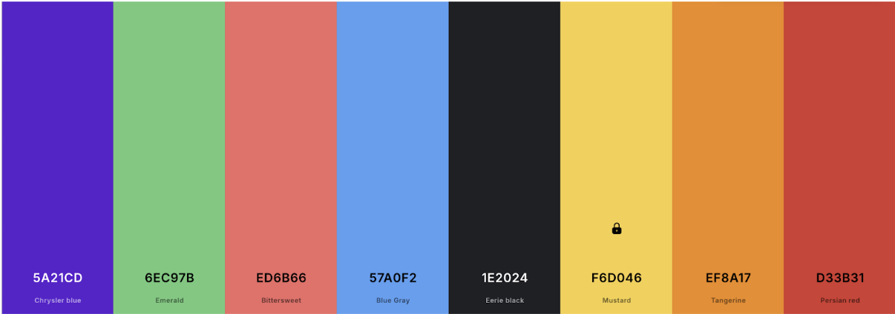
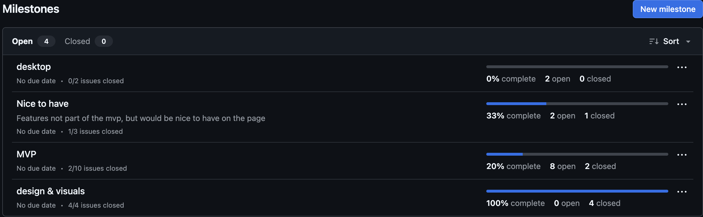
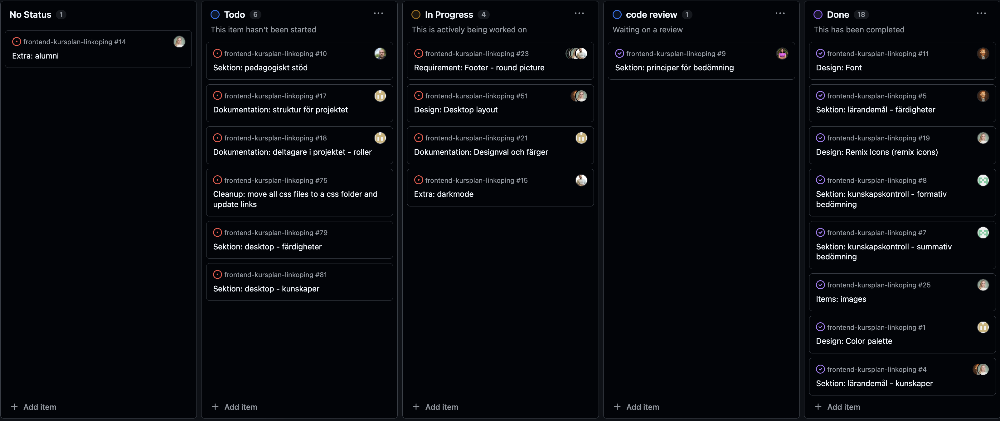

# frontend-kursplan-linkoping
Click [HERE](https://ollewarne.github.io/frontend-kursplan-linkoping/) to view the page!

## Who are we?
- Ingrid - Scrum Master
- Olle - Responsible for git
- Delzar - Designleads
- Malsha - Designleads
- Mattias - Developer
- Mårten - Developer
- Twana - Developer

## The techniques we have used in this project.
Html5 - structure.
Css3 - design and layout .
Javascript - interactivity.

## Goals for this project
- Deliver a page to Chasacademy about their courseplan in Frontend.

## Design
We chose to design the page using fun colors and shapes.  
Some of our design goals are:
- Mobile first

## Our goals
During week 42, our objective was to be done with all the planning for this project. We wanted to plan everything for the mobile version and be ready to start code on Monday week 43.
In week 43, our objective was to have our MVP for the mobile view finished — and we successfully achieved that goal.

### Colors
These are the colors we use on the page.
| Color Name | Hex Code |
|------------|----------|
| Chrysler blue | `#5a21cd` |
| Emerald       | `#6ec97b` |
| Bitterswee    | `#ed6b66` |
| Blue gray     | `#57a0f2` |
| Eerie black   | `#1e2024` |
| Mustard       | `#f6d046` |
| Tangerine     | `#ef8a17` |
| Persian red   | `#d33b31` |
| White         | `#ffffff` |

## Pictures
Below is a picture of the colors we chose to use for the design.  

Below is a picture of the milestones we created for this project.

Below is a picture of our Kanban project.

